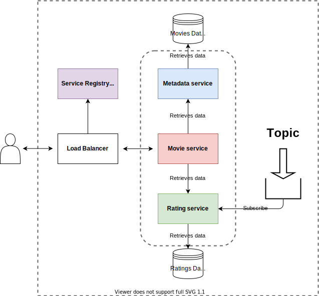
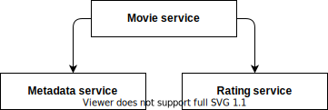
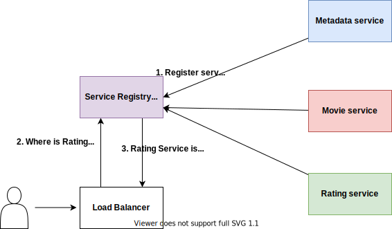

# MovieRating
MovieRating 서비스는 다음과 같은 기능을 사용자에게 제공한다.

* 사용자에게 영화 metadata(타이틀, 제작연도, 설명, 감독) 정보를 제공한다.
* 영화의 평점 정보를 제공한다.
* 사용자가 영화 평점을 매길수 있다.
  
## Overview



마이크로서비스 아키텍쳐로 개발하였다. 서비스와 역할은 다음과 같다.

* Metadata Service: Movie ID를 키로 영화 정보(metadata)를 저장하고 얻는다.
* Rating Service: 영화의 점수를 저장하고 평점을 얻는다.
* Movie Service: Metadata와 Rating 서비스를 이용하여 자세한 영화 정보(MovieDetail)을 얻는다.



Metadata, Rating 서비스는 독립적으로 동작한다.

Movie 서비스는 gRPC or HTTP를 통해 Metadata, Rating 서비스와 통신을 하여 자세한 영화정보 결과를 얻는다.


### 특징

### Service Discovery


server side discovery 방식으로 각 서비스의 위치를 찾아 호출한다. registry는 in-memory와 consul를 지원한다.

### Serialization

각 서비스는 gRPC를 이용하여 통신이 이루어진다.

### Asynchronous Communication

Rating 서비스는 메시지 브로커(kafka)를 통해 비동기로 데이터를 전달받는다.

### Database

Metadata, Rating 서비스는 postgresql을 이용하여 데이터를 저장한다.

### Service ports (default)
각 서비스는 gRPC 또는 http를 이용해 통신을 한다.
* metadata - 8081
* rating - 8082
* movie - 8083

### Project layout
```
|- CMakeLists.txt
|- api/                     // gRPC proto 파일
|- cmake/
|- docker/                  // 실행에 필요한 postgresql, consul, kafka, zookeeper docker-compose 파일
|- resources/               // 각 서비스 config 예제 파일 및 문서에 사용하는 리소스 파일
|- docs/                    // doxygen을 이용해 문서가 생성되는 경로
|- src/
|    |
|    |- common/             // 공통으로 사용하는 유틸함수
|    |- config/             // config 파일을 읽는 유틸 클래스
|    |- discovery/          // 서비스 디스커버리 유틸 클래스(consul)
|    |- metadata/           // movie metadata 서비스
|    |- movie/              // movie 서비스
|    |- rating/             // rating 서비스
```

## Configuration

설정파일은 yaml포맷이다. 설정 예제파일은 resources폴더에 있다.

metadata
```
application:
  name: metadata
  datasource:
    url: localhost:5432/movie_db        // database connetion url
    user: postgres                      // database user
    password: postgres                  // database password
  cloud:
    consul:
      host: localhost                   // consul
      port: 8500
    
grpc:
  server:
    host: localhost                     // service address
    port: 8081                          // service port

logging:
  file: /logs/metadata_log.txt
  level: info
  pattern:
    console: "%+"
    file: "%Y-%M-%d %H:%M:%S [%^%l%$] [thread %t] %v"
```
* Postgresql: connection url, user, password 설정
* consul: consul 서버의 정보를 설정한다.
* grpc.server: 서비스가 사용할 주소를 설정한다.

rating
```
application:
  name: rating
  datasource:
    url: localhost:5432/movie_db
    user: postgres
    password: postgres
  cloud:
    consul:
      host: localhost
      port: 8500
  kafka:
    consumer:
      bootstrap-servers: localhost:9092,localhost:9093,localhost:9094
      group-id: movie-rating
    
grpc:
  server:
    host: localhost
    port: 8082

logging:
  file: /logs/rating_log.txt
  level: info
  pattern:
    console: "%+"
    file: "%Y-%M-%d %H:%M:%S [%^%l%$] [thread %t] %v"
```
* kafka: kafka 브로커리스트와 그룹아이디를 설정한다.

## Building & Run

이 프로젝트는 Clang 13.0 이상이 필요하다. 현재 Clang만 지원한다.

프로젝트에서 사용하는 third-party 라이브러리는 vcpkg를 이용해 설치한다.

빌드를 위해서 아래와 같은 프로그램이 설치되어 있어야 한다.

* clang >= 13.0
* git
* vcpkg [https://vcpkg.io/]
* cmake >= 3.20.0
* doxygen

### Build
```
cmake -DCMAKE_CXX_COMPILER=/usr/bin/clang++ \
	  -DCMAKE_C_COMPILER=/usr/bin/clang \
	  -DCMAKE_MAKE_PROGRAM=/usr/bin/make \
	  -DCMAKE_TOOLCHAIN_FILE=$VCPKG_ROOT/scripts/buildsystems/vcpkg.cmake \
	  -B build
```

### Run
```
$ ./rating --config-file=[config file path]

$ ./metadata --config-file=[config file path]

$ ./movie --config-file=[config file path]
```